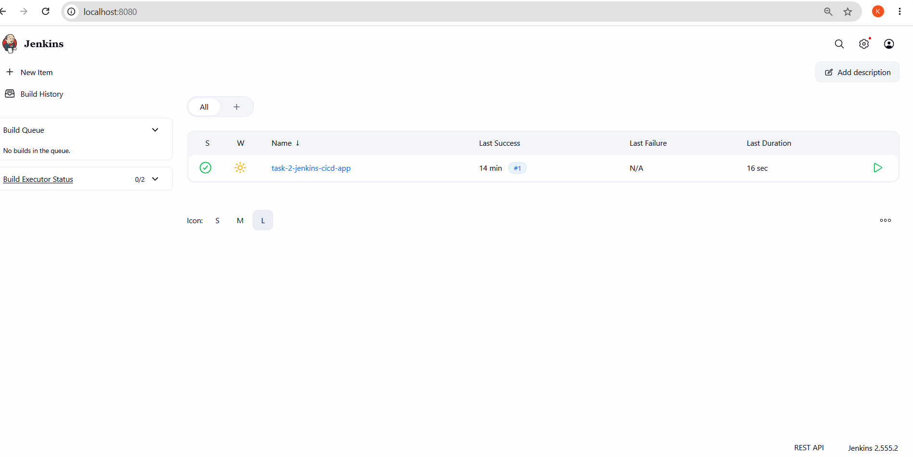
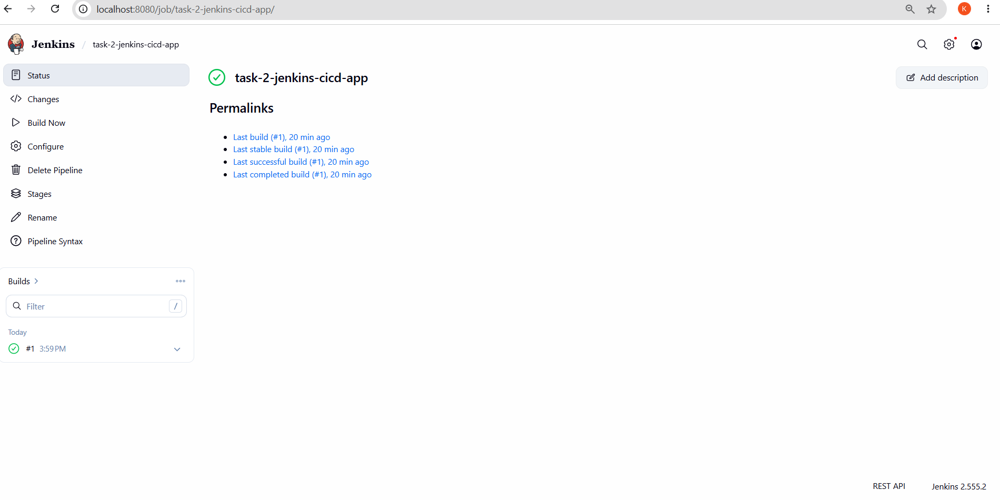
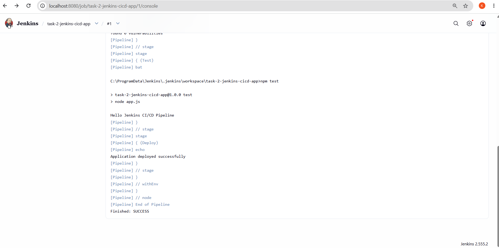
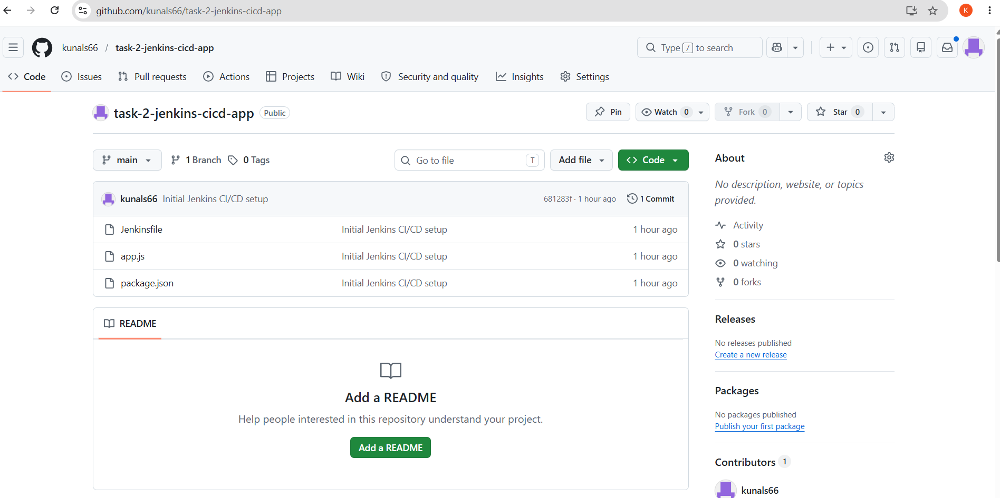

# Task 2 - Jenkins CI/CD Pipeline

## Objective

Create a simple CI/CD pipeline using Jenkins for a Node.js application.

## Tools Used

* Jenkins
* Node.js
* Git
* GitHub
* Java 25 LTS

## Project Structure

```text
task-2-jenkins-cicd-app
│
├── app.js
├── package.json
├── Jenkinsfile
└── README.md
```

## Application

app.js

```javascript
console.log("Hello Jenkins CI/CD Pipeline");
```

## Jenkins Pipeline

The pipeline consists of three stages:

1. Build
2. Test
3. Deploy

### Jenkinsfile

```groovy
pipeline {
    agent any

    stages {

        stage('Build') {
            steps {
                bat 'npm install'
            }
        }

        stage('Test') {
            steps {
                bat 'npm test'
            }
        }

        stage('Deploy') {
            steps {
                echo 'Application deployed successfully'
            }
        }
    }
}
```

## Build Result

The pipeline executed successfully and completed all stages.

Output:

```text
Hello Jenkins CI/CD Pipeline
Application deployed successfully
Finished: SUCCESS
```

## Screenshots

### Jenkins Dashboard



### Successful Build



### Console Output



### GitHub Repository



## Author

Kunal Suryawanshi
